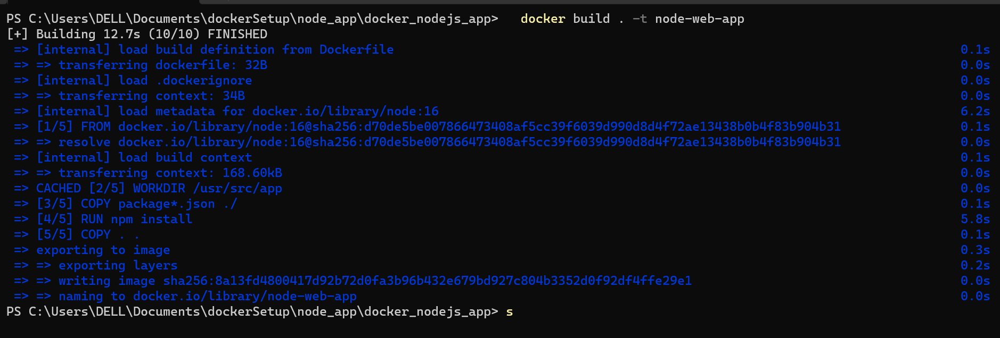
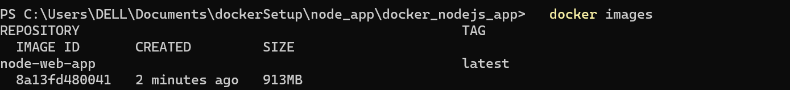

# Nodejs app Docker example

A Simple nodejs app using docker


## Authors

- [@vinodnextcoder](https://www.github.com/vinodnextcoder)


## Docker Deployment steps

- Building your image

Go to the directory that has your Dockerfile and run the following command to build the Docker image. The -t flag lets you tag your image so it's easier to find later using the docker images command:

```bash
  docker build . -t node-web-app
```


- Your image will now be listed by Docker:

```bash
  docker images
```



- Run the image
Running your image with -d runs the container in detached mode, leaving the container running in the background. The -p flag redirects a public port to a private port inside the container. Run the image you previously built:

```bash
  docker run -p 3000:3000 -d node-web-app
```

- Get container ID
```bash
  docker ps
```

- Print app output
```bash
  docker logs <container id>
```


## Tech Stack

**Server:** Node, Express, Docker

Hit api "http://localhost:3000
